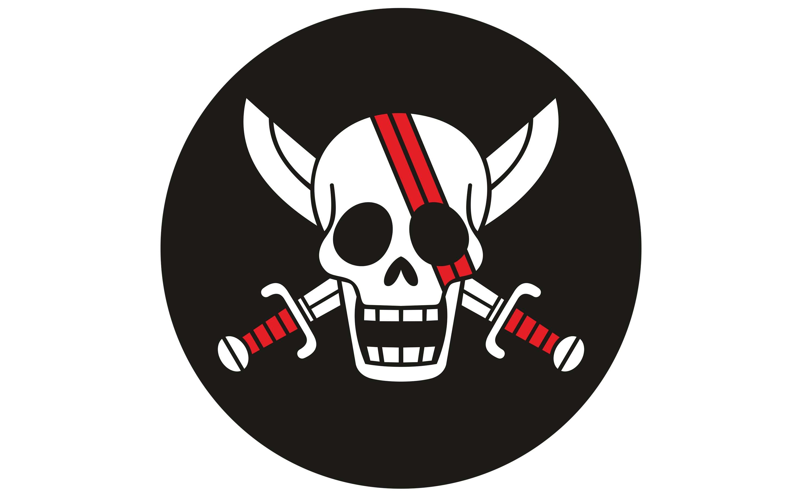

<!DOCTYPE html>
<html lang="es">
<head>
  <meta charset="UTF-8">
  <meta name="viewport" content="width=device-width, initial-scale=1.0">
  <title>Bitácora del Pelirrojo</title>
  
</head>
<body>

  <!-- Imagen fija centrada -->
  

  <!-- Contenido sobre el parallax -->
  

    <h1>Bitácora del Pelirrojo</h1>

    

      

        
Hace 39 años

        

          
ROGER SE ENCUENTRA A SHANKS EN UN COFRE TRAS EL INCIDENTE DE GOD VALLEY EN DICHA ISLA. EL NIÑO SONRÍE MIENTRAS VE A LA TRIPULACIÓN DE ROGER.

          
        

      

      

        
Hace 30 años

        

          
Shanks y Buggy forman parte de la tripulación de Roger.

          
        

      

      

        
Hace 28 años

        

          
Shanks y Buggy forman parte de la tripulación de Roger.

          
        

      

      

        
Hace 27 años

        

          
Participa en la batalla de Edd War junto a Roger.

          
        

      

      

        
Hace 26 años

        

          
Conoce a Teach. Roger parte hacia Laugh Tale sin él.

          
        

      

      

        
Hace 22 años

        

          
Presencia la ejecución de Roger. Rechaza formar banda con Buggy.

          
        

      

      

        
Hace 13 años

        

          
Roba la Fruta Gomu Gomu del Gobierno Mundial.

          
        

      

      

        
Hace 12 años

        

          
Luffy come la Gomu Gomu. Shanks pierde un brazo. Detiene a Tot Musica.

          
        

      

      

        
Hace 6 años

        

          
Es nombrado Yonkō oficialmente.

          
        

      

      

        
En la actualidad

        

          
Shanks decide ir a por el One Piece tras ver la recompensa de Luffy como Nika.

          
        

      

    

  

</body>
</html>
